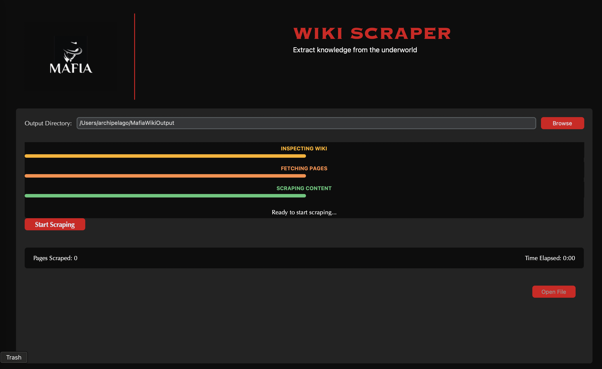

# Mafia Wiki Scraper

A tool to scrape content from the BNB Mafia GitBook wiki with a beautiful, easy-to-use interface.



## 🚀 Super Easy Installation (No Computer Knowledge Required!)

### Windows Users
1. Click the green "Code" button above and choose "Download ZIP"
2. Extract the ZIP file anywhere on your computer
3. Double-click `install.bat`
4. That's it! You'll find "Mafia Wiki Scraper" on your desktop 🎉

### Mac Users
1. Click the green "Code" button above and choose "Download ZIP"
2. Extract the ZIP file
3. Open Terminal (press Cmd+Space, type "terminal", press Enter)
4. Type these commands:
   ```bash
   cd path/to/extracted/folder
   chmod +x install.sh
   ./install.sh
   ```
4. That's it! You'll find "Mafia Wiki Scraper" on your desktop 🎉

## ✨ Features

- 🖼️ Beautiful, modern graphical interface
- 🔄 Real-time progress updates
- 🎵 Sound effects for feedback
- 💾 Automatic saving of scraped content
- 📁 Easy output file access
- ⚡ Fast, parallel scraping

## 📝 Output

The scraped content will be saved in:
- **Windows**: `C:\Users\YourUsername\MafiaWikiOutput\`
- **Mac**: `~/MafiaWikiOutput/`

## 🛠️ For Developers

### Installation

```bash
git clone https://github.com/yourusername/mafia_wiki_scraper.git
cd mafia_wiki_scraper
pip install -e .
```

### Running Tests

```bash
pip install -r requirements-dev.txt
pytest
```

### Project Structure

```
mafia_wiki_scraper/
├── mafia_wiki_scraper/
│   ├── __init__.py
│   ├── cli.py
│   ├── gui.py
│   └── scraper.py
├── tests/
│   ├── __init__.py
│   ├── test_cli.py
│   └── test_scraper.py
├── requirements.txt
├── requirements-dev.txt
└── setup.py
```

## 📄 License

This project is licensed under the MIT License - see the LICENSE file for details.

## 🤝 Contributing

Contributions are welcome! Feel free to submit a Pull Request.
